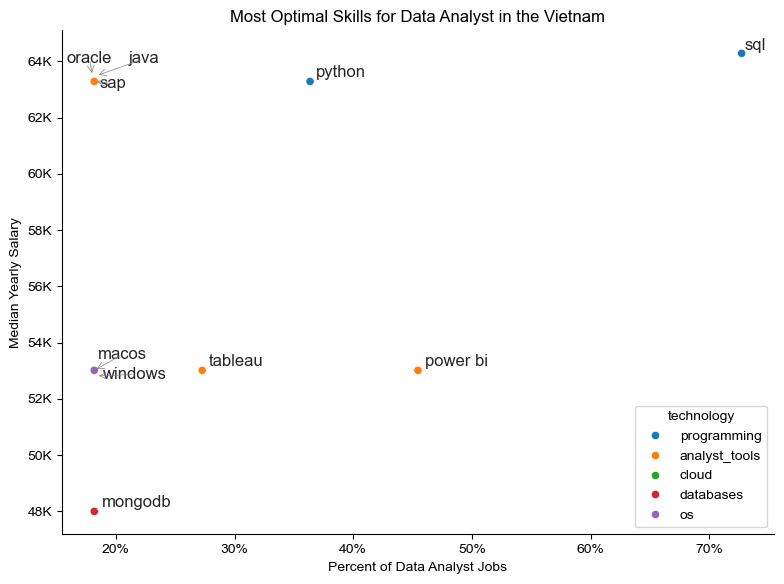
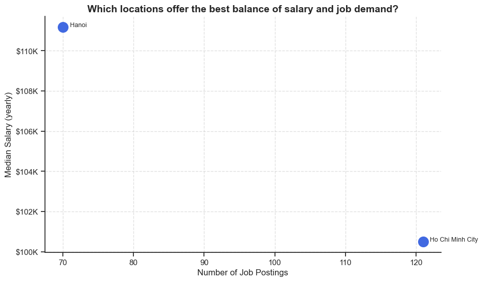
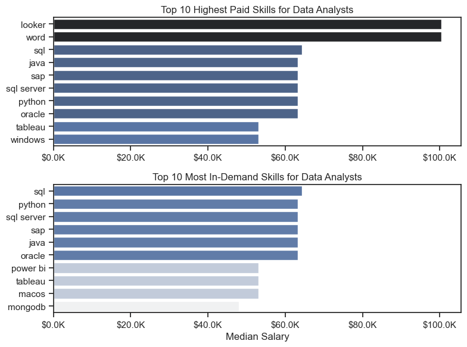
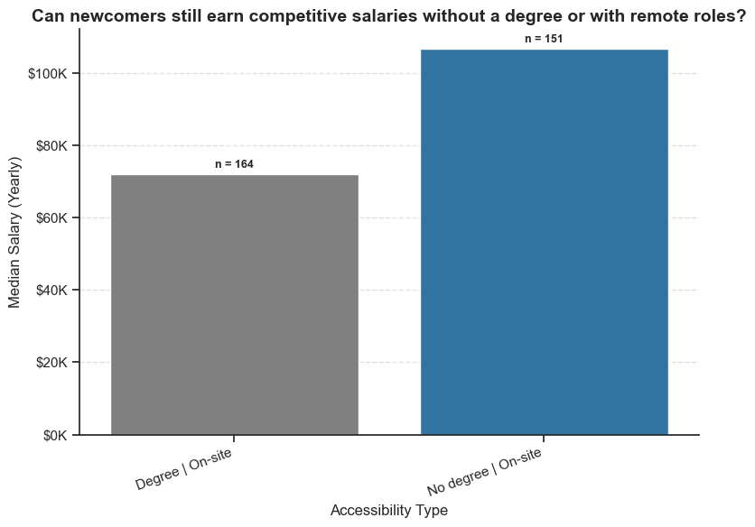
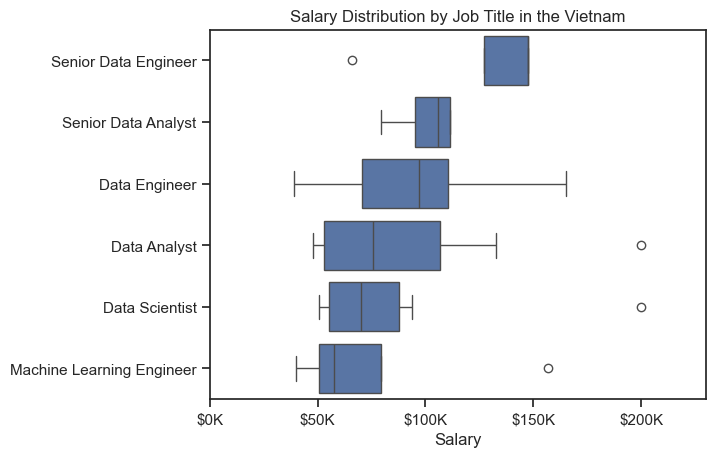
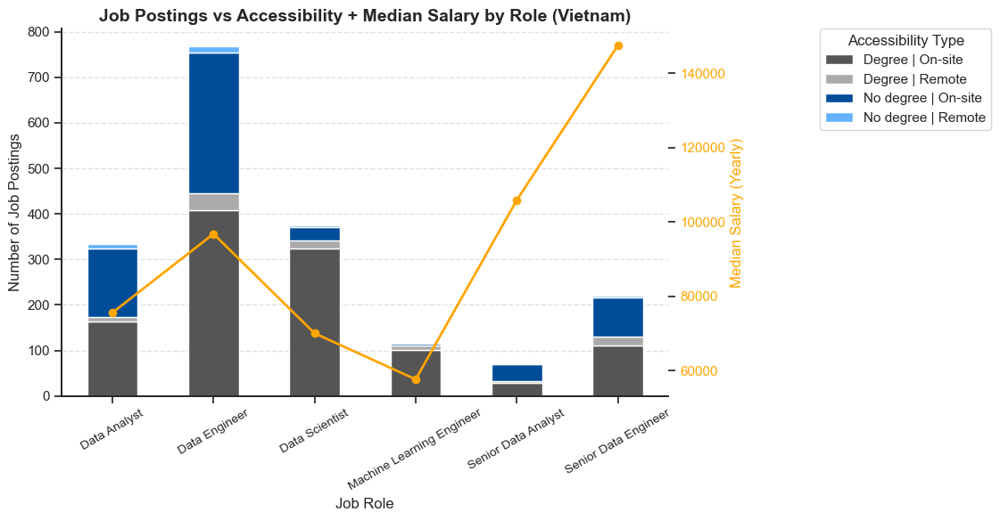

# 📌 Overview
This project explores the Vietnamese job market for Data-related roles in 2023, with a focus on **Data Analyst (DA)** as the most common entry pathway.  
It analyzes salaries, skill demand, and accessibility (degree requirements, remote work options) to help career switchers and early-career professionals understand how to prepare for a Data career in Vietnam.  

**Source:** The dataset is adapted from **Luke Barousse's Course**, filtered to highlight job postings and salary insights relevant to the Vietnamese market.  

# Questions I Answered
1. **Which skills are most effective for newcomers (in terms of opportunities & salary)?**  
   → Identified technologies that combine high demand and strong pay.  

2. **How can Data Analysts maximize salary in Vietnam?**  
   → Evaluated the role of location, technical skills, and degree requirements.  

3. **How do DA opportunities compare with other data-related roles?**  
   → Compared salaries, application accessibility, and transferable skills for career transitions into 

# Tools I Used
- **Python Libraries**  
  - `ast` → parse structured text data  
  - `pandas` → data manipulation & analysis  
  - `datasets` (Hugging Face) → dataset loading  
  - `matplotlib.pyplot` → data visualization  
  - `seaborn` → advanced plotting & styling  

- **Environment**  
  - **Jupyter Notebook** → step-by-step analysis  
  - **VS Code** → project management and development  
  - **GitHub** → version control and portfolio showcase  

# The Analysis
## 1. Which skills are most effective for newcomers (in terms of opportunities & salary)?
I analyzed skills by grouping them to calculate median salaries and their likelihood of appearing in job postings. The results were visualized to show the relationship between salary potential and demand across skills. This highlighted which technologies are both more prevalent and more rewarding for newcomer

View my notebook with detailed steps here:
[2. High_ROI_Skills.ipynb](2.%20High_ROI_Skills.ipynb)

#### Visualize Data
```python
# Scatter plot: likelihood vs salary, highlight technologies
sns.scatterplot(data=df_plot, x='skil_likelihood', y='median_salary', hue='technology')

# Add & adjust text labels to avoid overlap
from adjustText import adjust_text
texts = [plt.text(x, y, txt) for x, y, txt in zip(df['skil_likelihood'], df['median_salary'], df.index)]
adjust_text(texts, arrowprops=dict(arrowstyle='->', color='gray', lw=0.5))

# Format axis for readability
ax = plt.gca()
ax.yaxis.set_major_formatter(plt.FuncFormatter(lambda y, _: f'{int(y/1000)}K'))
ax.xaxis.set_major_formatter(PercentFormatter(decimals=0))
```

#### Result


#### Insights
- **SQL** stands out as the most effective skill, offering both the highest demand (appearing in ~70% of postings) and one of the strongest salary levels, making it essential for newcomers.
- **Python** also provides strong opportunities, balancing relatively high demand (~35%) with one of the top salary ranges, showing its value for career growth.
- While **Power BI** are widely requested, they are associated with lower salary levels compared to programming and database skills, suggesting they are useful complements but not the primary drivers of higher pay.

## 2. How can Data Analyst maximize salary — what to learn and where to work in Vietnam?

- 📍 Location matters: Hanoi tends to reward analysts with higher pay, while Ho Chi Minh City offers more job openings and stronger demand.
- 💻 Skills that pay: Focus on SQL and Python — they’re the backbone of most roles and give you both stability and growth. Niche tools can add value, but they shouldn’t replace your core stack.
- 🎓 Degree not required: Many high-paying opportunities don’t demand a formal degree, proving that practical skills and adaptability can take you just as far — especially in remote roles.

View my notebook with detailed steps here:
[3. Salary_Maximization_Strategies.ipynb](3.%20Salary_Maximization_Strategies.ipynb)

### 2.1. Which locations offer the best balance of salary and job demand?
I analyzed job postings by grouping them based on location to calculate the median salary for each city. The results were visualized to compare demand, measured by posting counts, against pay, represented by median salary. This highlighted which locations offer both strong hiring activity and attractive compensation levels

#### Visualization
```python
# Scatter plot: job demand vs median salary by location
plt.scatter(df_plot['no_job_posted'], df_plot['median_salary'], s=200, color='royalblue')

# Add city labels
for city, row in df_plot.iterrows():
    plt.text(row['no_job_posted']+1, row['median_salary'], city, fontsize=9)

# Format salary axis in $K
ax = plt.gca()
ax.yaxis.set_major_formatter(plt.FuncFormatter(lambda x,_: f'${int(x/1000)}K'))
```
#### Result


#### Insights
- **Hanoi** offers the highest median salary (≈$111K), though with fewer postings, making it attractive for those prioritizing pay.
- **Ho Chi Minh City** provides more job opportunities (≈120 postings) but with slightly lower salaries (≈$101K), suggesting stronger demand but less pay leverage.

### 2.2.  Which technical skills provide the best balance between salary potential and market demand?
I analyzed technical skills by grouping them to calculate both median salaries and demand levels across postings. The analysis identified the top 10 skills in terms of salary and the top 10 in terms of demand, allowing a direct comparison between earning potential and market need. The results were visualized with bar charts to highlight which skills strike the best balance between strong pay and widespread relevance.

#### Visualization
```python
# Compare top-paying vs most in-demand skills for Data Analysts
fig, ax = plt.subplots(2,1, figsize=(8,6))

sns.barplot(data=df_da_top_pay, x='median', y='job_skills', ax=ax[0], palette='dark:b_r')
ax[0].set_title('Top 10 Highest Paid Skills')

sns.barplot(data=df_da_skills, x='median', y='job_skills', ax=ax[1], palette='light:b')
ax[1].set_title('Top 10 Most In-Demand Skills')

# Format salary axis in $K
for a in ax:
    a.xaxis.set_major_formatter(plt.FuncFormatter(lambda x,_: f'${int(x)/1000}K'))
```
#### Result


#### Insights
- **SQL** and **Python** stand out as the most effective skills, appearing at the top of demand rankings while also providing strong salaries, making them essential for career stability and growth.
- High-paying but less common skills like **Looker** and **Word** offer strong salary potential, but their limited demand suggests they are niche rather than core skills for most data analyst roles.

### 2.3. Can newcomers still earn competitive salaries without a degree or with remote roles?
I analyzed job postings by splitting them based on degree requirements and remote availability. Median salaries were then compared across these groups to understand the trade-off between accessibility and pay. Skill requirements were also overlaid to identify which accessible roles still provide strong earning potential, with results visualized through boxplots.

#### Visualization
```python
# Median salary by accessibility (Degree/No degree, Remote/On-site)
df_grouped = df_plot.groupby(
    df_plot.apply(lambda r: f"{'No degree' if r.job_no_degree_mention else 'Degree'} | "
                            f"{'Remote' if r.job_work_from_home else 'On-site'}", axis=1)
).agg(median_salary=('median_salary','median'), n=('no_job_posted','sum'))

sns.barplot(data=df_grouped, x=df_grouped.index, y='median_salary', palette=palette)
for p, n in zip(ax.patches, df_grouped['n']):
    ax.text(p.get_x()+p.get_width()/2, p.get_height()+1000, f"n={n}", ha='center')
```

#### Result


#### Insights
- Roles that **do not require a degree** offer significantly higher median salaries (≈$107K) compared to traditional degree-required positions (≈$72K), showing strong earning potential even without formal education.
- Although degree-required jobs are slightly more common (164 postings vs. 151), the salary premium in no-degree roles suggests newcomers can still compete effectively without academic credentials.

## 3. How do DA opportunities compare with other roles, and how transferable are DA skills?
- 💰 Salary outlook: Data Analysts earn around $75K median, with clear paths to higher pay — Senior roles exceed $120K. Data Engineers (~$95K) offer stronger starting salaries, while Data Scientists (~$70K) and ML Engineers (~$65K) show growth potential but tighter entry.
- 💻 Transferable skills: Python, SQL, and AWS form the universal backbone. Building on these with role-specific tools — big data platforms for engineering, machine learning frameworks for science/ML — enables smooth transitions.
- 🎓 Accessibility in Vietnam: DA is the most approachable entry role with many postings not requiring a degree. Data Engineer is also promising for non-degree entrants, while Data Scientist skews more toward degree-dependent paths. Senior positions remain aspirational for the long term.

View my notebook with detailed steps here:
[4. Career_Pathways_Beyond_DA.ipynb](4.20%Career_Pathways_Beyond_DA.ipynb)

### 3.1. How do salaries differ across DA and other data-related roles?
I filtered the dataset to include only postings in Vietnam with valid salary information and focused on the six most frequent job titles within data-related roles. Median salaries were calculated for each role to establish a clear ranking of pay levels. The results were visualized with a boxplot to compare salary distributions and highlight differences across roles.

#### Visualization
```python
# Salary distribution across top job titles
sns.boxplot(
    data=df_salary_vn_top6,
    x='salary_year_avg',
    y='job_title_short',
    order=job_order
)
```

#### Result


#### Insights
- **Senior roles** such as Senior Data Engineer and Senior Data Analyst command the highest salaries, with median pay well above $120K, highlighting strong rewards for experience.
- **Entry and mid-level roles** like Data Analyst, Data Scientist, and Machine Learning Engineer offer lower median salaries (~$60K–$90K), but with wider ranges, indicating opportunities for growth as skills and experience advance.

### 3.2. What skill additions allow a DA to “upgrade” into other data-related roles?
I analyzed job postings beyond the Data Analyst role by parsing their listed skills and identifying the top 10 most common requirements for each target position alongside those for Data Analysts. The overlap was used to highlight transferable skills, while the gaps revealed additional capabilities needed to transition. These insights were summarized into a roadmap table showing the skill pathways for moving from DA into other data-related roles.

#### Visualization
```python
# Map transferable vs new skills for each target role
df_skill_upgrade = pd.DataFrame([
    {
        "Target Role": role,
        "Transferable Skills (from DA)": list(set(da_top_skills) & set(skills)),
        "Skills to Learn": list(set(skills) - set(da_top_skills))
    }
    for role, skills in role_skill_map.items()
])
```

#### Result
What skill additions allow a DA to “upgrade” into other data-related roles?

| Target Role              | Transferable Skills (from DA)                | Skills to Learn                                              |
|---------------------------|-----------------------------------------------|--------------------------------------------------------------|
| Data Engineer             | python, sql, aws                             | nosql, airflow, spark, mongodb, kafka, java, hadoop          |
| Data Scientist            | aws, python, tableau, sql, r                 | spark, pytorch, tensorflow, java, hadoop                     |
| Machine Learning Engineer | python, sql, aws                             | keras, spark, pandas, pytorch, tensorflow, java, scikit-learn |
| Senior Data Analyst       | python, excel, sas, tableau, sql, power bi, r | bigquery, pyspark, spark                                     |
| Senior Data Engineer      | python, sql, aws                             | nosql, airflow, spark, mongodb, kafka, java, hadoop          |

#### Insights
- Core **transferable skills** such as Python, SQL, and AWS serve as the foundation across all advanced roles, making them essential for Data Analysts aiming to upgrade.
- To transition, analysts need to build **specialized skills** tailored to each role—like big data tools (Hadoop, Spark, Kafka) for engineering paths, or machine learning frameworks (TensorFlow, PyTorch, Keras) for science and ML careers.

### 3.3. How do the application opportunities for Data Analyst compare with other data-related roles in Vietnam?
I examined job postings to compare differences in accessibility factors such as degree requirements and remote work availability across Data Analyst and other data-related roles. Posting volumes were then visualized with stacked bar charts to show how these qualifications and options affect application opportunities by role.

#### Visualization
```python
# Median salary by role
df_salary_median = df_vn_roles.groupby('job_title_short')['salary_year_avg'].median()

# Stacked bar: accessibility mix
df_pivot.plot(kind='bar', stacked=True, 
              color=[custom_palette[c] for c in df_pivot.columns])

# Overlay line: median salary trend
plt.plot(df_pivot.index, df_salary_median.reindex(df_pivot.index), 
         color='orange', marker='o', linewidth=2)
```
#### Result


#### Insights
- **Data Analyst** shows over 300 postings with many positions not requiring a degree, offering a median salary of around $75K. This makes it the most accessible entry point for career switchers.
- Among peer-level roles, **Data Engineer** (~750 postings, $95K) is highly promising since many postings accept candidates without a degree, while **Data Scientist** (~350 postings, $70K) leans heavily on degree requirements, making it less suitable for non-traditional entrants.
- **Senior roles** (Senior Data Analyst, Senior Data Engineer) have far fewer postings but command significantly higher salaries (up to $145K for Senior Data Engineer), highlighting long-term growth potential rather than immediate entry paths.

## Conclusion

This project shows that **Data Analyst** remains the most accessible entry point into the Vietnamese data job market.  
However, salaries for DA are relatively modest compared to roles like **Data Engineer, Data Scientist, and Senior Analyst**, which reward additional technical depth and specialization.  

Key takeaways:
- **High ROI skills** such as Python, SQL, and cloud tools (AWS) are both in high demand and well-compensated, making them essential for career growth.  
- **Skill transferability is strong**: DA professionals can pivot to higher-paying roles by adding role-specific tools (e.g., Spark, TensorFlow, Airflow).  
- **Accessibility factors matter**: Many DA jobs in Vietnam do not strictly require a degree, making the field more open compared to other roles.  

In short, **DA is a strong starting point**, but to achieve higher salary and career mobility, analysts should continuously upskill in engineering, machine learning, or BI tools depending on their desired career path.

---

👉 Detailed methodology and results are documented in Jupyter notebooks, structured into four main parts:
1. `1. EDA.ipynb`  
2. `2. High_ROI_Skills.ipynb`  
3. `3. Salary_Maximization_Strategies.ipynb`  
4. `4. Career_Pathways_Beyond_DA.ipynb`  